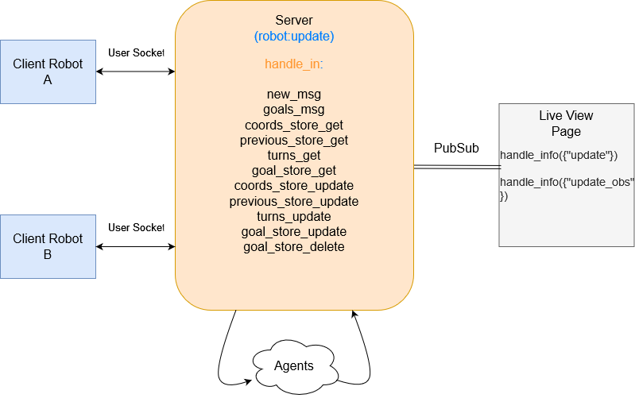
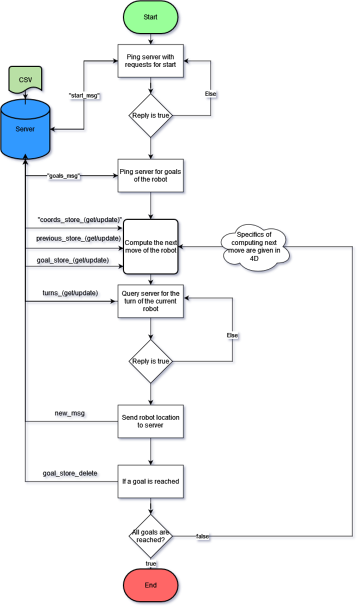

# Strategy Followed by Team 2339 for Task 4C

## Introduction

For the given Task 4C to be successfully integrated with the Algorithm we have used to complete Task 3. A large number of helper functions were required.

Principally the message passing occurs through the **robot:update** channel itself.
Furthermore, all the variables that need to store state are initialized using **Agents** when one of the robots first connects to the server.

## Working

The diagram given below encapsulates the basic structure of message passing in our Task.

Communication between robots takes place through the server. And communication between channel and live-view takes place through Elixir **PubSubs** and message passing.

### In-Depth Live-View

The handle_info function handles input from PubSubs. Aside from the inbuilt functions we're using two other functions:

- **"update"** This gets called every time a **"new_msg"** is sent to the robot channel and contains information about movement and orientation of the robot on the Live-view.

- **"update_obs"** This gets a MapSet object and is called every time the robot encounters an obstacle, it basically displays the object on the Live-view arena.

### In-Depth Channel

The channel file contains a variety of Agents to store State about the two robots as well as the associated functions to manipulate the states. The main functions which are made for each agent are 'update and get'.
The following are the functions of each of the functions:

- **"new_msg"**: This msg is sent from client to channel. On sending the channel updates the robot's position in the live-view using a PubSub message. It then returns true or false based on if there's an obstacle in front of the bot or not.
- **"start_msg"**: This message is sent every two second from each client to the server, it checks whether the start button is pressed and whether the program can be executed.
- **"goals_msg"**: Sent after the program gets the start instruction, this message returns the list of goals needed by the robot.
- **"coords_store\_(get/update)"**: Each robot updates its value in this map after every turn. Useful for letting the other robot know where the other one is headed. It serves to prevent collisions between them.
- **"previous_store\_(get/update)"**: Stores the previous locations of the robots. If a robot is stationary for to long, it detects it using this map and forcibly tries to move.
- **"goal_store\_(get/update/delete)"**: Stores all the current **unvisited** goal locations. Once a location is visited, it is eliminated from the Map. Serves to signal the send of the program.
- **"turns\_(get/update)"**: Contains informations on which robot's turn it is currently. Before moving the robots check to see if it is their turn to move. If it is then they move and update this value signalling that it is the other robot's turn.

### In Depth Client

The client consists of task_4c_client_robot(a/b) and their corresponding socket client files.

The messages are passed to the server through the socket client.

### Algorithm

The algorithm followed by each of the client robots can be briefly summarised as follows:

1. Ping server with requests to check if the timer has started or not.
2. Once the timer starts, get the required goals from the server and update them in the Channel's state variables, get the start location of the robot as well.
3. Compute the movement to be made by the robot
4. Check whether it is the robot's turn to move by querying the server. If not, query again in a few milliseconds. If it is then move the robot.
5. After moving the robot send the updated location to the server.
6. If an obstacle is encountered then the move to be made will be a rotation, send the location of the obstacle to the server.
7. If a goal is reached, update it in the Server's state variables(Agents).
8. Start again from 3
9. Once all goals are reached, end the program

### Pictorial Representation: -

